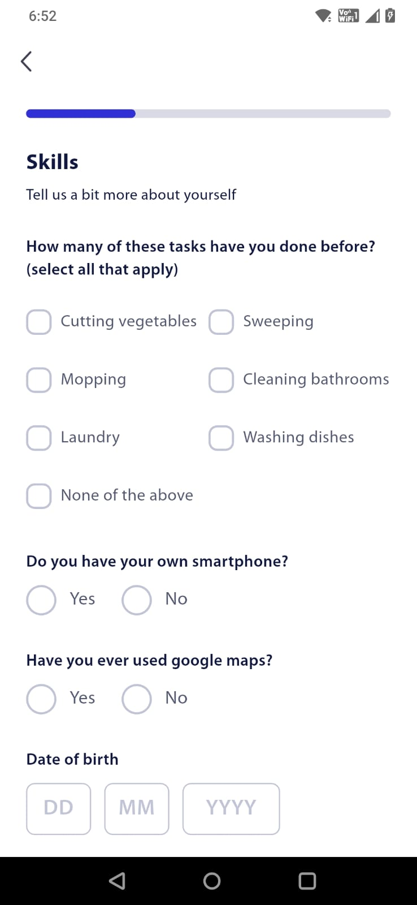
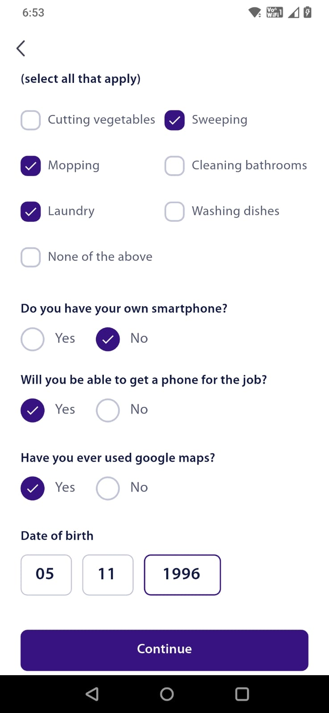
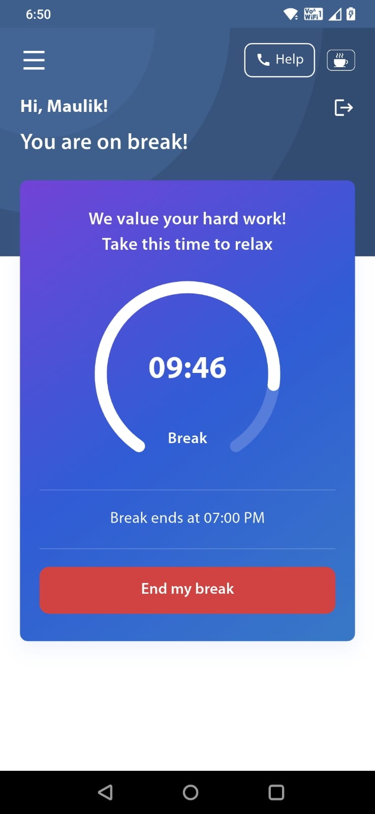
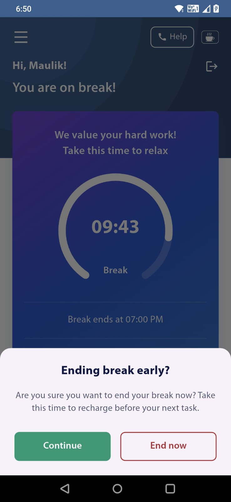
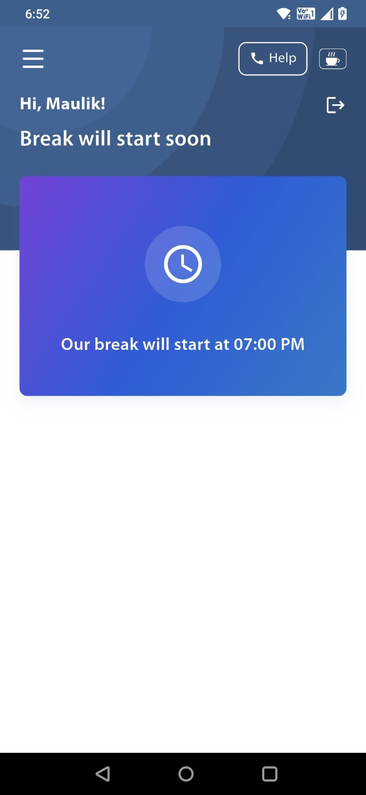

# Break Management App

A Flutter application for efficient break management with Firebase backend integration.

## 📱 Screenshots

<div align="center">
  
  
  
  
  <br>
  
  
  
  
</div>

## ✨ Features

- User authentication with Firebase
- Break tracking and management
- Real-time data synchronization
- Responsive design
- Offline support
- Custom UI with Myriad Pro fonts

## 🛠 Tech Stack

- **Flutter** 3.8.1+
- **Firebase** (Auth, Firestore, Database)
- **Provider** for state management
- **Go Router** for navigation
- **Get It** for dependency injection

## 🚀 Getting Started

### Prerequisites
- Flutter 3.8.1+
- Firebase project setup

### Installation

1. **Clone the repository**
   ```bash
   git clone https://github.com/yourusername/break_manage.git
   cd break_manage
   ```

2. **Install dependencies**
   ```bash
   flutter pub get
   ```

3. **Firebase Setup**
   - Create Firebase project
   - Add `google-services.json` to `android/app/`
   - Add `GoogleService-Info.plist` to `ios/Runner/`

4. **Run the app**
   ```bash
   flutter run
   ```

## 📁 Project Structure

```
lib/
├── core/           # Constants, services, utils
├── features/       # App features (dashboard, auth, etc.)
├── assets/         # Fonts and icons
└── main.dart       # App entry point
```

## 📦 Dependencies

- `provider: ^6.1.2` - State management
- `go_router: ^16.0.0` - Navigation
- `firebase_core: ^3.15.1` - Firebase core
- `firebase_auth: ^5.6.2` - Authentication
- `cloud_firestore: ^5.6.11` - Database
- `get_it: ^7.6.0` - Dependency injection

## 📱 Build

```bash
# Android
flutter build apk

# iOS
flutter build ios
```

## 🤝 Contributing

1. Fork the repository
2. Create feature branch
3. Commit changes
4. Push to branch
5. Open Pull Request

---

**Made with ❤️ using Flutter**
